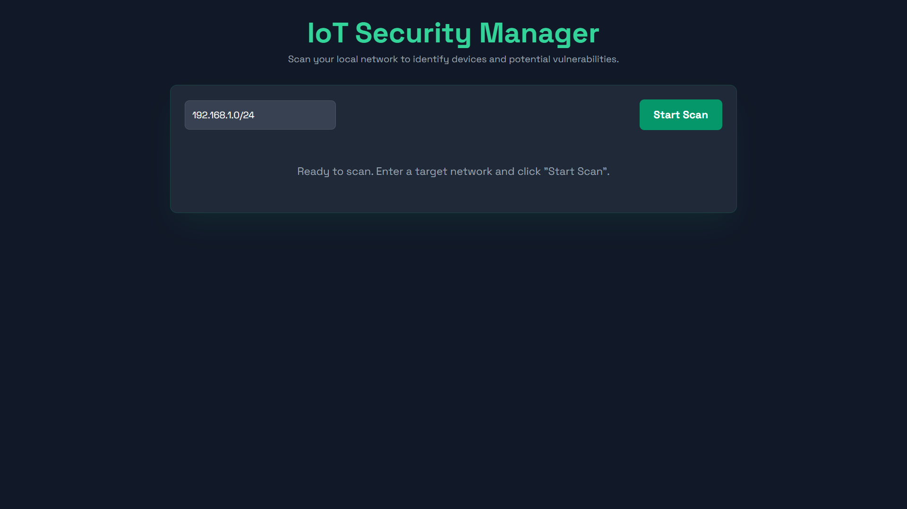

IoT Device Security Manager
A Python and Flask-based web application that scans a local network to identify connected devices, discover open ports, and highlight potential security vulnerabilities.

Features
Network Discovery: Uses Nmap to perform a comprehensive scan of a specified network range (e.g., 192.168.1.0/24).

Device Identification: Identifies device vendors based on their MAC address.

Port Scanning: Detects open TCP ports on each device and identifies the running service.

Vulnerability Highlighting: The user interface highlights common, potentially insecure ports like Telnet (23), FTP (21), and SSH (22) to draw attention to them.

Web-Based Dashboard: Presents scan results in a clean, modern, and easy-to-read web interface.

Tech Stack
Backend: Python, Flask

Network Scanner: Nmap (python-nmap library)

Frontend: HTML, Tailwind CSS, JavaScript

Setup and Installation
To run this project locally, you will need Python and the Nmap command-line tool installed on your system.

Clone the repository:

git clone https://github.com/vikihacker1/iot-security-manager.git
cd iot-security-manager

Install Nmap:
Download and install Nmap for your operating system from nmap.org. Ensure its location is added to your system's PATH.

Create a virtual environment:

python -m venv venv
venv\Scripts\activate  # On Windows
# source venv/bin/activate  # On macOS/Linux

Install Python dependencies:

pip install -r requirements.txt

Run the application:
Note: Nmap scans often require administrator/sudo privileges.

python app.py

Open your browser and navigate to http://127.0.0.1:5001.
